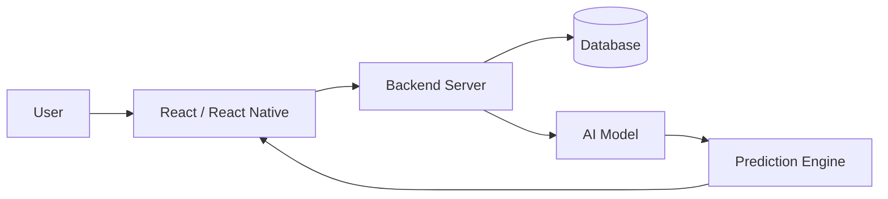

<!-- 👑 ADVANCED PRO Animated Banner -->

<!-- 👑 UPDATED PROFESSIONAL BANNER -->

<p align="center">
  
</p>

---

<h1 align="center">👑 Shivam Kumar</h1>

<h3 align="center">
Cybersecurity Enthusiast | 🏆 Hackathon Winner of INNOVATE X 5.0 - 2k26 🏆 | AI & Python Developer | CTF Player
</h3>


---


<p align="center">
  
  
  
</p>

---

## 🧠 Professional Summary

Highly motivated **Full Stack Developer, AI & Cybersecurity Enthusiast** with proven experience in building scalable, real-world applications. Proficient in **React, React Native, Python, and Machine Learning**, with a strong focus on **secure system design and performance optimization**. Recognized for delivering impactful solutions in **hackathon environments**, with a problem-solving mindset and a commitment to clean, efficient, and production-ready code.


---

## 🧠 Developer Profile

```yaml
Name: Shivam Kumar
Role: security researcher / Vulnerability analyzer
Experience:
  - Cybersecurity Intern (Amroha Cyber Cell - APCSIP 2025)
  - Hackathon Winner (INNOVATE X 5.0 - 2026)
Technical Skills:
  - Frontend: React.js, HTML, CSS, JavaScript
  - Mobile: React Native
  - Backend: Python
  - AI/ML: Data Analysis, Prediction Models
  - Tools: Git, GitHub, VS Code
Focus Areas:
  - Full Stack Development
  - AI-based Systems
  - Cybersecurity Fundamentals
Goal: Build scalable, secure, and impactful applications
```

---

## ⚡ Tech Stack

<p align="center">
  
</p>

---

## 🚀 Featured Projects

### 🧠 AI & Machine Learning

🔹 **[AI-Based Early Warning System for Shipment Delays](https://github.com/Shivam255-ai/AI-Based-Early-Warning-System-for-Shipment-Delays)**
📌 Predicts shipment delays using machine learning and logistics data

🔹 **[Crop Yield Prediction Project](https://github.com/Shivam255-ai/Crop-Yield-Prediction-Project)**
📌 Forecasts agricultural output using data-driven ML models

🔹 **[Cyber Threat Detection System](https://github.com/Shivam255-ai/Cyber-Threat-Detection-System)**
📌 Identifies anomalies and potential cyber threats using AI

---

### 📱 Mobile Application

🔹 **[Cross Platform Mobile App (React Native)](https://github.com/Shivam255-ai/Cross-Platform-Mobile-App-using-React-Native)**
📌 Modern mobile app with reusable components and responsive UI

---

### 🌐 Full Stack & Web Development

🔹 **[Smart Attendance System](https://github.com/Shivam255-ai/Smart-attendance-system)**
📌 Automates attendance tracking with efficient backend integration

🔹 **[My Application](https://github.com/Shivam255-ai/My-Application)**
📌 End-to-end full stack web application

---

## 🧠 System Architecture



---

## 📊 GitHub Analytics & Performance

<p align="center">
  
  
</p>

<p align="center">
  
</p>

<p align="center">
  
</p>

<p align="center">
  
</p>

---


---

## 🏆 Achievements & Vision

🏆 Hackathon Winner – INNOVATE X 5.0 (2026)
💼 Cybersecurity Intern – Amroha Cyber Cell
🚀 Building real-world AI & full stack applications
📈 Continuously improving development & problem-solving skills

---

## 📬 Contact

<p align="center">
  <a href="https://www.linkedin.com/in/shivam-kumar-8a407628b">
    
  </a>
  <a href="mailto:shivam25kyp@gmail.com">
    
  </a>
</p>

---

## 💡 Philosophy

> “Consistency and execution beat talent every time.”

---

<p align="center">
🚀 <b>Building Secure • Scalable • Intelligent Systems</b>
</p>
