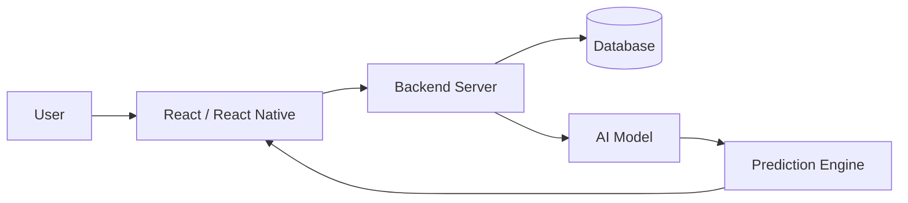

<!-- 👑 ADVANCED PRO Animated Banner -->

<p align="center">
  
</p>

---

<h1 align="center">👑 Shivam Kumar</h1>
<h3 align="center">🚀 Full Stack Developer • AI Engineer • Problem Solver</h3>

<p align="center">
  
  
  
</p>

---

## 🎯 Professional Summary

✔️ Full Stack Developer with focus on **scalable web & mobile applications**
✔️ Strong expertise in **React & React Native ecosystems**
✔️ Hands-on experience in **AI-based real-world systems**
✔️ Passionate about **problem-solving, hackathons & innovation**
✔️ Open to **internships, collaborations & tech opportunities**

---

## 🧠 Developer Profile

```yaml
Name: Shivam Kumar
Role: Full Stack Developer
Specialization:
  - React.js
  - React Native
  - AI / Machine Learning Systems
Tech Focus:
  - Scalable Applications
  - Clean UI/UX
  - Performance Optimization
Mission: Build impactful, production-ready applications
```

---

## ⚡ Tech Stack

<p align="center">
  
</p>

---

## 🚀 Featured Projects (With Impact)

### 🧠 AI & Machine Learning

🔹 **AI-Based Early Warning System for Shipment Delays**
📌 Predicts shipment delays using ML models & logistics data
🔗 https://github.com/Shivam255-ai/AI-Based-Early-Warning-System-for-Shipment-Delays

🔹 **Crop Yield Prediction System**
📌 Uses data-driven models to forecast agricultural output
🔗 https://github.com/Shivam255-ai/Crop-Yield-Prediction-Project

🔹 **Cyber Threat Detection System**
📌 Detects anomalies & potential cyber threats using AI
🔗 https://github.com/Shivam255-ai/Cyber-Threat-Detection-System

---

### 📱 Mobile Application

🔹 **Cross Platform Mobile App (React Native)**
📌 Scalable mobile app with reusable components & responsive UI
🔗 https://github.com/Shivam255-ai/Cross-Platform-Mobile-App-using-React-Native

---

### 🌐 Full Stack & Web Development

🔹 **Smart Attendance System**
📌 Automates attendance tracking with efficient backend logic
🔗 https://github.com/Shivam255-ai/Smart-attendance-system

🔹 **My Application (Full Stack Project)**
📌 End-to-end web application with frontend & backend integration
🔗 https://github.com/Shivam255-ai/My-Application

---

### 🏆 Hackathon Project

🔹 **HACKFEST BBSR Project**
📌 Built under hackathon constraints focusing on innovation & speed
🔗 https://github.com/Shivam255-ai/HACKFEST-BBSR

---

## 🧠 System Architecture



---

## 📊 GitHub Analytics

<p align="center">
  
  
</p>

<p align="center">
  
</p>

---

## 🐍 Contribution Activity

<p align="center">
  
</p>

---

## 🏆 Achievements & Vision

🚀 Building **production-ready applications**
🏆 Actively participating in **hackathons & competitions**
💡 Developing **AI-powered scalable systems**
📈 Continuously improving **development & problem-solving skills**

---

## 🌐 Portfolio

🚧 Portfolio Website Coming Soon
(Will include live demos, case studies & deployment links)

---

## 📬 Contact

<p align="center">
  <a href="https://www.linkedin.com/in/shivam-kumar-8a407628b">
    
  </a>
  <a href="mailto:shivam25kyp@gmail.com">
    
  </a>
</p>

---

## 💡 Philosophy

> “Consistency and execution beat talent every time.”

---

## ⭐ Final Note

<p align="center">
🚀 <b>Building Real Impact Through Code • One Project at a Time</b>
</p>
